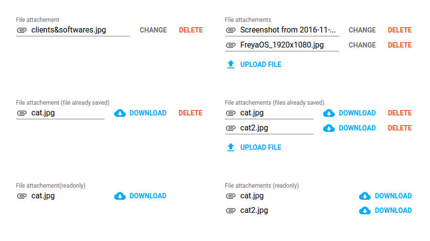
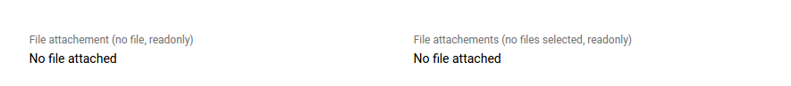

# \<etools-file\>

This element will allow you to select and prepare the files you are gonna upload.
The component doesn't upload the files, it just manages an array of them, which is reachable from the parent component.







## Usage

### Examples
```html
<etools-file files="{{files}}" label="Single file selection" accept=".jpg"></etools-file>

<etools-file files="{{files}}" label="Single file selection" readonly></etools-file>

<etools-file files="{{multipleFiles}}" multiple></etools-file>

<etools-file files="{{multipleFiles}}" multiple readonly></etools-file>

<etools-file files="{{files}}"
  label="Attachement (validation error shown)"
  invalid="[[invalid]]"
  error-message="Error message that will show only is invalid=true">
</etools-file>
```

Properties:
* accept, String - files types to accept for selection
* disabled, Boolean, default: false
* files, Array, default: [] – notifies
* label, String, default: 'File attachment'
* multiple, Boolean, default: false
* readonly, Boolean, default: false
* uploadLabel, String, default: 'Upload File'
* invalid, Boolean, default: false
* errorMessage, String, default: ''
* noFileAttachedMsg, String, default: 'No file attached'
* fileModel, Object, default null, file object model
* useDeleteEvents Boolean, default false
* activateFileTypes, Boolean, default false
* fileTypes, Array, default []
* fileTypesLabel, String, default 'File Type'
* showUploadDate, Boolean, default false
* showUploadBtnAbove, Boolean, default false


## Styling

You can use defined variables to change main colors.

Custom property | Description | Default
 ----------------|-------------|----------
 `--etools-file-secondary-text-color` | Secondary text color | `rgba(255, 255, 255, 0.54)`
 `--etools-file-main-btn-color` | Main buttons text color(upload and download buttons) | `#00acff`
 `--etools-file-delete-btn-color` | Delete button text color | `#f1572a`
 `--etools-file-single-file-wrapper` | Mixin applied to single file name wrapper | `{}`
`--etools-file-filename-container` | Mixin applied to the filename container | `{}`
`--etools-file-readonly-filename-container` | Mixin applied to the filename container(only if it's readonly) | `{}`
`--etools-file-actions-multiple` | Mixin applied to file action buttons container if multiple is `true` | `{}`
`--etools-file-actions-single` | Mixin applied to file action buttons container for single file selection | `{}`
`--etools-file-error` | Mixin applied to the error message element | `{}`
`--etools-file-type-underline-color` | File type underline color | `rgba(0, 0, 0, 0.12)`
`--etools-file-area-with-type-border-color` | File area with type underline color | `rgba(0, 0, 0, 0.12)`
`--etools-file-label` | File type underline color | `rgba(0, 0, 0, 0.12)`
`--etools-file-area-with-type` | File area with type mixin | `{}`
`--etools-file-upload-button-paper-btn` | Upload btn paper-button mixin | `{}`
`--etools-file-upload-button` | Upload button mixin | `{}`

## Install
```bash
$ npm install --save etools-file
```

## Preview element locally

Install needed dependencies by running: `$ npm install`.
Run `polymer analyze -i ./etools-file.js > analysis.json` to generate the file used by the Demo pages.
Make sure you have the [Polymer CLI](https://www.npmjs.com/package/polymer-cli) installed. Then run `$ polymer serve` to serve your element application locally.

## Linting the code

Innstall local npm packages (run `npm install`)
Then just run the linting task

```bash
$ npm run lint
```
You should also use polylint. If you don't have Polylint installed run `npm install -g polylint`.
Then just run the linter on each file you wish to check like so

```bash
$ polylint -i filename.html
```
At the moment polylint crashes if it encounters a missing import. If that happens, temporarily comment out such imports and run the command again.

## Running Tests

You need to have `web-component-tester` installed (if not run `npm install -g web-component-tester`)
```bash
$ wtc
```
or
```bash
$ wtc -p
```
